# Architecture Overview

This document illustrates the target AWS landing zone architecture created by this Terraform stack, and highlights optional components you can enable via variables.

## Core Networking and Compute

```mermaid
flowchart LR
  subgraph AWS[VPC]
    direction TB

    IGW[Internet Gateway]

    subgraph Public[Public Subnets]
      direction LR
      ALB[(ALB - optional)]
      NAT[NAT GW - optional]
    end

    subgraph Private[Private Subnets]
      direction LR
      EC2[EC2 Linux/Windows (N) ]
      RDS[(RDS - optional)]
    end

    RTpub[Public Route Table]
    RTpriv[Private Route Tables]

    RTpub --> IGW
    Public --> RTpub
    Private --> RTpriv
    RTpriv --> NAT

    ALB -- app_port --> EC2
  end

  Internet((Internet)) --> IGW
```

Legend:
- Public Subnets: Contain the internet-facing Application Load Balancer (if enabled) and NAT Gateway(s) for egress.
- Private Subnets: Contain EC2 instances and RDS (if enabled). Recommended for production workloads.
- Ingress:
  - If `enable_alb = true`, clients enter via ALB DNS. With `enforce_alb_only_ingress = true`, only ALB-to-EC2 traffic is allowed on `app_port`.
  - If `ec2_use_public_subnets = true` and you define permissive SG ingress, EC2 can be reached directly (not recommended for prod).
- Egress:
  - Private instances reach the Internet via NAT (if `enable_nat_gateway = true`).

## Optional Components


- S3: `create_s3_bucket = true` enables a private bucket with versioning and SSE by default.
- ALB HTTPS: `alb_enable_https = true` and `alb_certificate_arn` attaches an ACM certificate and (optionally) redirects HTTP→HTTPS.
- RDS: `create_rds = true` provisions DB in private subnets with its own SG and subnet group.

## Security Posture Options
- Instance ingress:
  - Default: no public ingress (`ec2_common_security_rules.ingress = []` in example).
  - ALB-only: `enforce_alb_only_ingress = true` allows only ALB→EC2 on `app_port`.
  - Public SSH/HTTP: add explicit SG rules in `ec2_common_security_rules` (not recommended for prod).
- Access and management:
  - SSM: `compute_enable_ssm = true` attaches the SSM role/profile so you can use Session Manager instead of opening SSH.

## Scaling Compute
Two approaches:
- Explicit: list instances in `instances = [ ... ]`.
- Generated: set `linux_instance_count` and/or `windows_instance_count` plus defaults blocks; Terraform will create N instances per OS with consistent settings.

## Data Flow Summary
- Inbound:
  - Internet → ALB (80/443) → EC2 (app_port) when ALB enabled.
  - Internet → EC2 (public IP and SG rule) if you explicitly choose that pattern.
- Outbound:
  - EC2 in private subnets → NAT → Internet for updates/package repos.
- Internal:
  - EC2 → RDS over DB port (e.g., 3306) controlled by RDS SG rules.

## Icon-styled Topology (Mermaid)

```mermaid
flowchart TB
  %% Icons via emojis in labels for quick visual parsing
  Internet((🌐 Internet))

  subgraph VPC[🕸️ VPC]
    direction TB
    IGW[🔗 Internet Gateway]
    subgraph PUB[🟦 Public Subnets]
      ALB[(🧭 ALB - optional)]
      NAT[🧱 NAT Gateway - optional]
    end
    subgraph PRIV[🟩 Private Subnets]
      EC2[(🖥️ EC2: Linux/Windows x N)]
      RDS[(🗄️ RDS - optional)]
    end
    RTpub[🧭 Public RT]
    RTpriv[🧭 Private RTs]

    PUB --> RTpub --> IGW
    PRIV --> RTpriv --> NAT
    ALB -- app_port --> EC2
  end

  Internet --> IGW
```



Legend:
- 🟦 Public subnets: ALB, NAT
- 🟩 Private subnets: EC2, RDS
- 🔗 IGW: Internet ingress/egress
- 🧭 RT: Route Table
- app_port: configurable application port (default 80)

## ASCII Topology (Copy/Paste Friendly)

```
               +--------------------+
               |     Internet       |
               +----------+---------+
                          |
                          v
                 +------------------+
                 |       IGW        |
                 +----+--------+----+
                      |        |
          +-----------+        +-------------------------------+
          |                                                (VPC)
   +------+-------+                               +-----------+--------+
   |  Public RT   |                               |  Private RT(s)     |
   +------+-------+                               +-----------+--------+
          |                                                   |
   +------+-------+                                    +------+--------+
   | Public Subn. |                                    | Private Subn. |
   +------+-------+                                    +------+--------+
          |                                                   |
   +------+-------+     (optional)                     +------+--------+      (optional)
   |   ALB        +------------------ app_port ------->|    EC2 (N)   +----->|    RDS     |
   +--------------+                                    +---------------+      +------------+
          |
   (optional)
   +--------------+
   |   NAT GW     |
   +------+-------+
          |
          v
      (Egress to Internet for Private EC2)
```

## Request Flow (Runtime)


Notes:
- If `enable_alb = false`, traffic can go directly to EC2 only if instances are public and SGs allow it.
- For HTTPS, ALB uses your ACM certificate when `alb_enable_https = true`.

## Provisioning Flow (Terraform)

```mermaid
flowchart TD
  TF[Terraform Apply] --> VPC[VPC]
  VPC --> IGW[Internet Gateway]
  VPC --> SUBP[Public Subnets]
  VPC --> SUBR[Private Subnets]
  SUBP --> RTP[Public Route Table]
  SUBR --> RTR[Private Route Tables]
  RTP --> IGW
  TF -->|if enabled| NAT[NAT Gateway(s)]
  RTR --> NAT
  TF -->|optional| S3[S3 Bucket]
  TF --> SG[Compute Security Group]
  TF --> AMI[AMIs (Linux/Windows lookup)]
  TF --> EC2[EC2 Instances]
  EC2 --> SG
  TF -->|optional| ALB[Application Load Balancer]
  ALB --> TG[Target Group + Listeners]
  TG --> EC2
  TF -->|optional| RDS[RDS + Subnet Group + Param Group]
```


